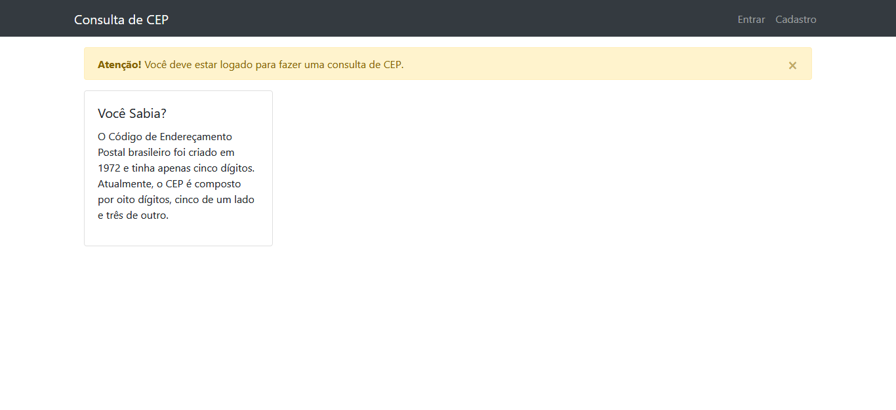
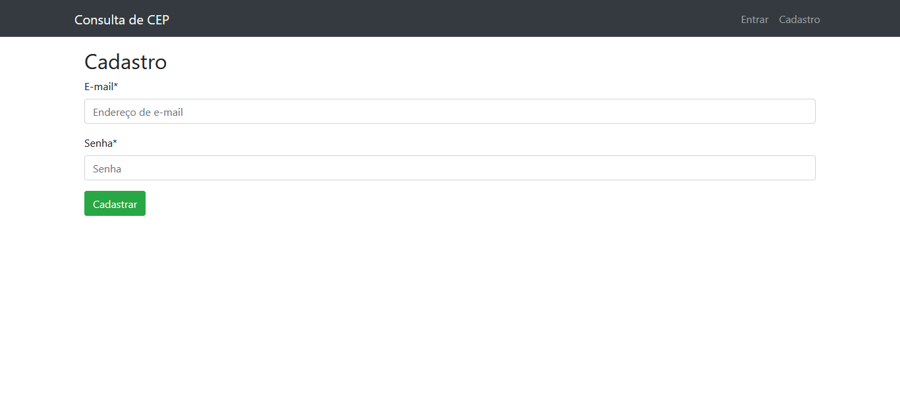
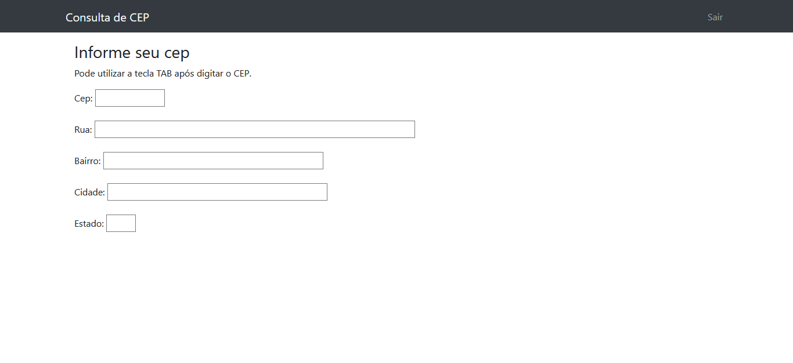

Aplicação web com tela de login e acesso a API ViaCep
para consultar Cep e retornar endereço, cidade e bairro.

Suportada versão 3 de Python

[](https://www.travis-ci.com/heltonteixeira92/Proj_teste)
[](https://pyup.io/repos/github/heltonteixeira92/Proj_teste/)

 Para instalar as dependecias:

```console python -m venv .venv .venv\Scripts\activate pip install -r requirements-dev.txt```

Para conferir qualidade de código padrão pip8:

```rodar comando flake8 no terminal```


Pictures:




